区块链实验 1 图数据库 TuGraph 基本操作 ------ Elliptic++ 数据集

一、基础知识和准备

1.图数据库概述

图数据库是一种基于图理论的数据存储与管理系统，以 "顶点 - 边 - 属性"
的三元组结构对现实世界中的事物及其关联关系进行建模与存储。与传统关系型数据库通过表、行、列组织数据的方式不同，图数据库原生支持复杂关联关系的高效表达与查询，能够直观呈现实体间的多对多、层级嵌套等复杂联系，在处理社交网络、金融交易网络、知识图谱等场景中的关联分析任务时，具有远超传统数据库的查询效率和灵活性。

图数据库的核心优势在于将数据间的关系作为数据本身进行存储和索引，避免了关系型数据库中多表连接查询带来的性能损耗，可快速遍历海量实体间的路径、关联强度等关键信息，是支撑大数据时代复杂关联分析需求的核心技术之一。

2.TuGraph 数据库介绍

TuGraph
是由蚂蚁集团和清华大学联合研发的高性能分布式图数据库，历经蚂蚁集团 50
万核图计算集群与 300 +
实际业务场景的长期锤炼，在国际图数据库基准测试中多次斩获性能第一的成绩，是支付宝万亿级业务背后的核心图数据库支撑。

（一）核心特性

全栈图技术体系：整合图存储、图计算、图学习与图研发平台，提供从数据存储到分析建模的全流程解决方案；

高性能与高扩展性：支持大数据容量存储、低延迟查找与快读图分析，能够应对高吞吐率、海量数据的处理需求，具备业界领先规模的图集群部署能力；

丰富的功能支持：采用属性图模型，原生支持 Cypher
查询语言，提供图形化操作界面与命令行接口，支持数据导入、查询、更新、删除等完整的数据生命周期管理；

便捷的部署方式：支持阿里云计算巢免费试用，同时可通过 Docker 容器在本地
Windows、Linux 等系统中快速部署，降低使用门槛。

（二）核心组件

图存储引擎：负责顶点、边及属性数据的持久化存储与高效索引，保障海量数据的快速访问；

查询引擎：支持 Cypher
声明式查询语言，能够解析并执行复杂的图查询逻辑，返回精准结果；

图形化管理界面：通过 Web
端提供可视化的建模、数据导入、查询结果展示功能，降低操作复杂度；

数据导入工具：支持 CSV
等格式文件的批量导入，提供灵活的数据映射配置，适配不同结构的数据集。

3.图模型基础

TuGraph 采用属性图模型（Property Graph Model），其核心组成包括三大要素：

顶点（Vertices/Nodes）：表示现实世界中的实体，例如交易记录、钱包地址、电影、人物等，每个顶点可关联唯一标识（ID）、标签（Label，用于区分实体类型）和多个属性（Property，以键值对形式存储实体的特征信息）；

边（Edges/Relationships）：表示顶点间的关联关系，例如交易中的资金流向、钱包地址间的交互、演员与电影的出演关系等，边具有方向性（如
"资金从 A 地址流向 B
地址"）、类型标签（用于区分关系类型）和属性（如交易金额、交易时间等）；

属性（Property）：附着于顶点或边上的键值对数据，用于描述实体或关系的具体特征，例如顶点
"交易" 的属性可包括交易时间、交易金额、交易类型等，边 "资金流向"
的属性可包括转账金额、转账手续费等。

这种模型能够直观、灵活地刻画复杂网络结构，为后续的关联分析、路径查询等操作提供基础。

4.实验数据集准备

本实验选用 Elliptic++
数据集，该数据集基于比特币区块链的交易记录与钱包地址交互数据构建，是图网络分析领域的经典数据集，适用于区块链交易关联分析、非法交易识别等场景。数据集分为两大模块，具体信息如下：

（一）Elliptic++ Transactions Dataset（交易数据集）

核心文件：txs_classes.csv（交易节点分类数据）、txs_edgelist.csv（交易边列表数据）；

边的含义：边表示交易间的资金流动关系，反映比特币在不同交易中的转移路径。

（二）Elliptic++ Actors (Wallet Addresses) Dataset（钱包地址数据集）

核心文件：wallets_classes.csv（钱包地址分类数据）、AddrAddr_edgelist.csv（钱包地址间边列表数据）；

边的含义：边表示钱包地址间的交互关系，包括直接转账关联与通过交易间接产生的关联，反映钱包地址的网络拓扑结构。

二、实验操作

1.使用Docker打开TuGraph并通过浏览器打开其web前端

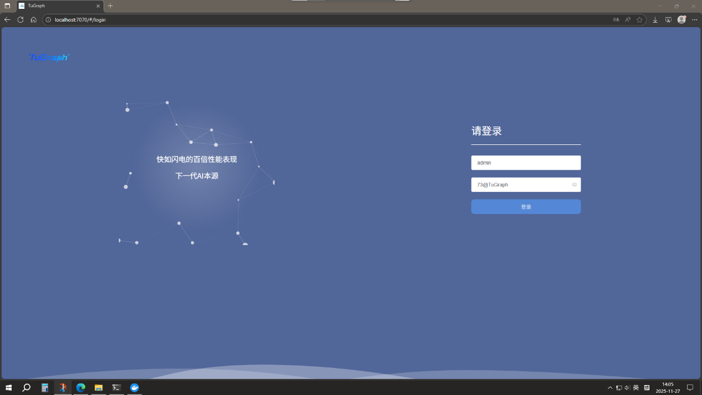

2.输入账号密码成功登录

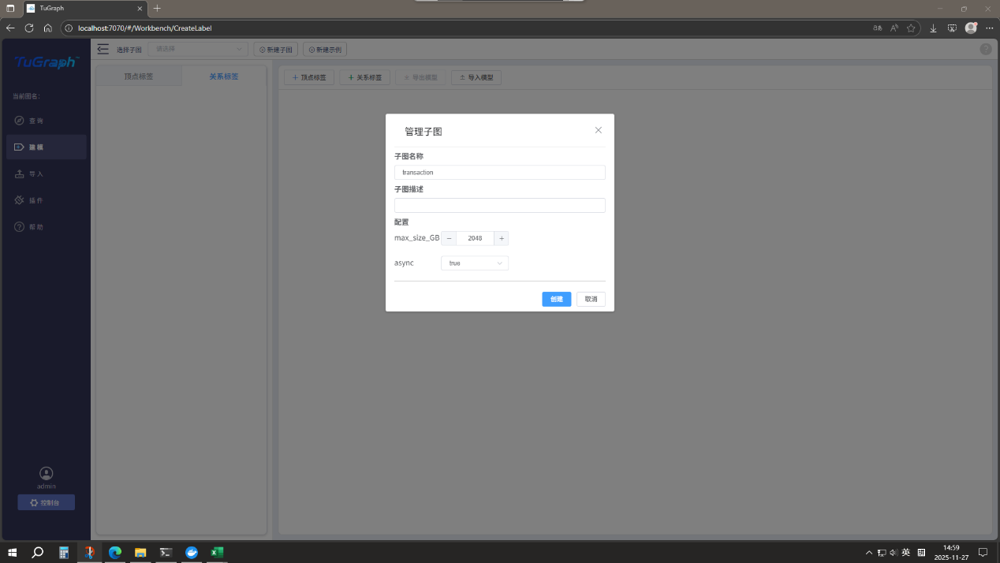

3\. 对Transactions
Dataset数据集（txs_classes.csv、txs_edgelist.csv）进行图建模和数据导入

（1）添加顶点标签

（2）添加边标签

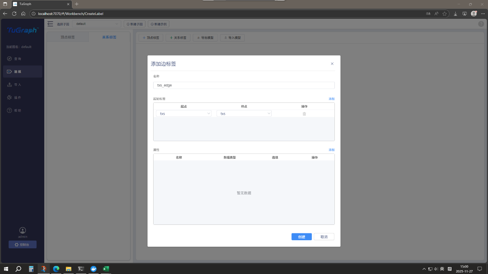

（3）选择映射并导入数据

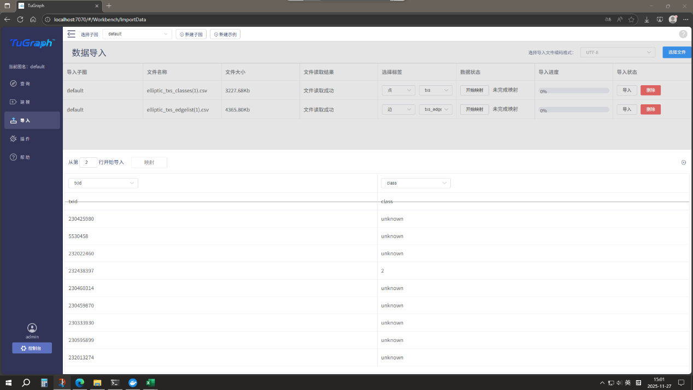

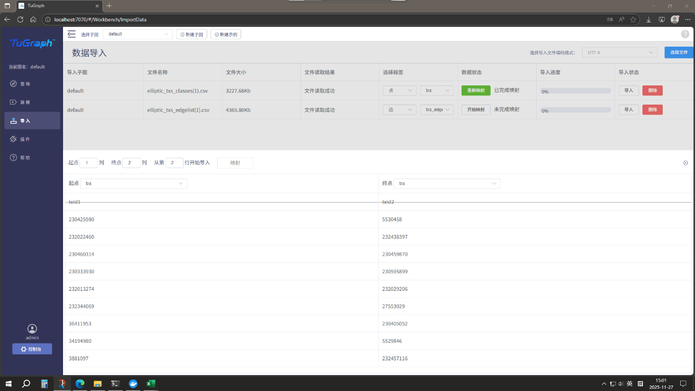

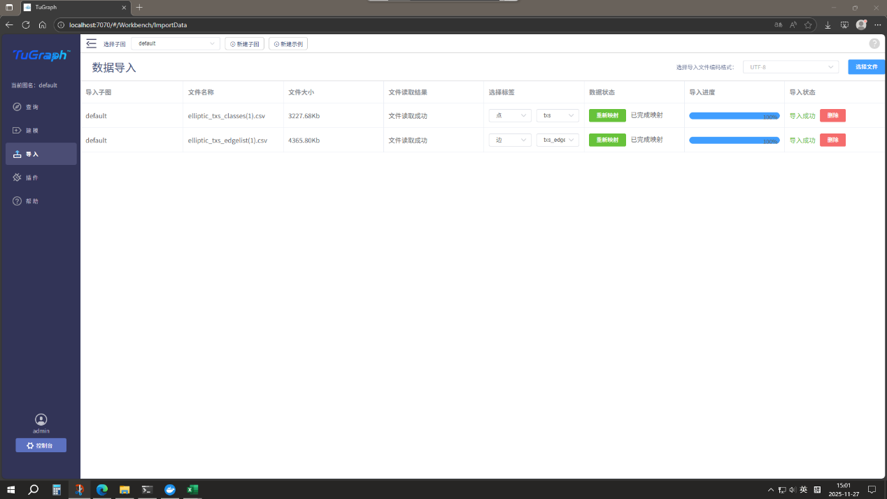

4\. 对Actors
Dataset数据集（wallets_classes.csv、AddrAddr_edgelist.csv）进行图建模和数据导入

（1）创建新的子图"wallet"，添加顶点标签

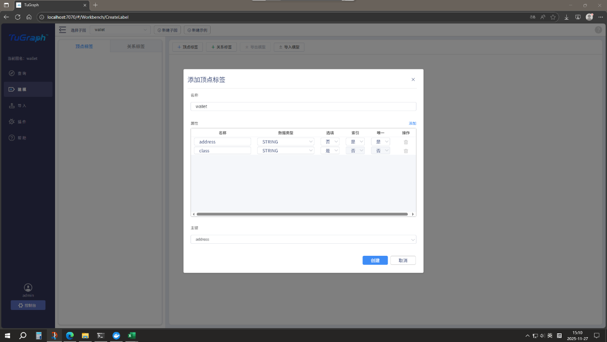

（2）添加边标签

（3）选择映射并导入数据

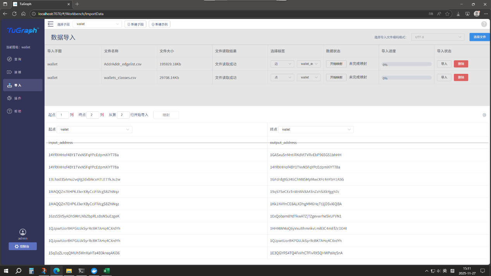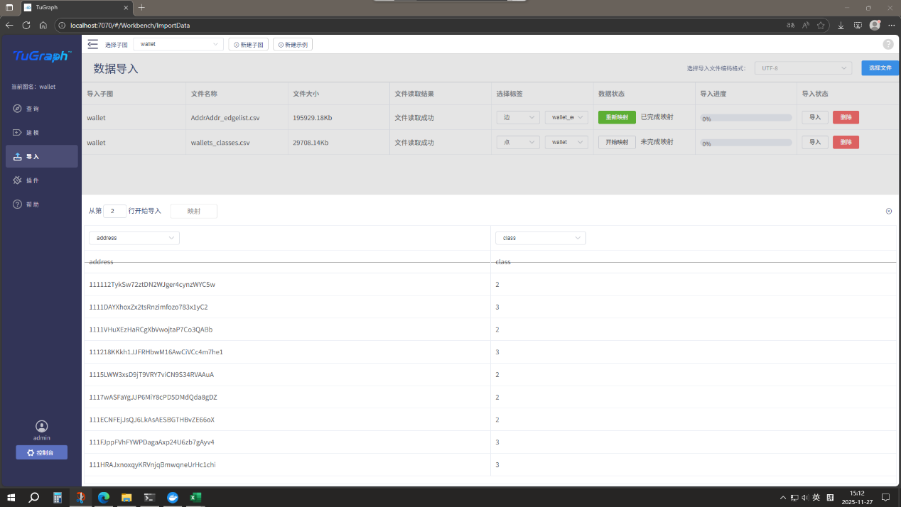
5.使用Cypher语句进行查询

（1）查询点

MATCH (n) WHERE n.class="2" RETURN n LIMIT 100

查询100个class为2（合法）的点

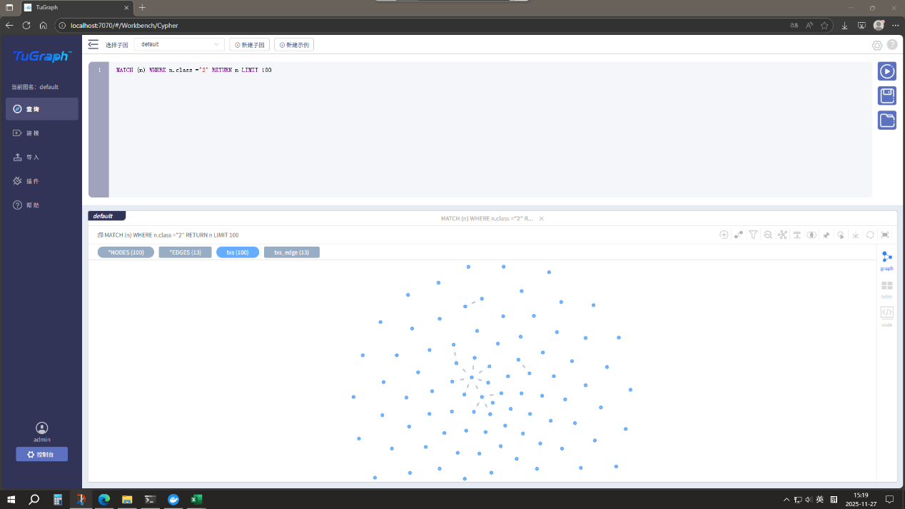

（2）查询边

match p = (n)-\[r\]-\>(m) return p LIMIT 100

匹配任意关系

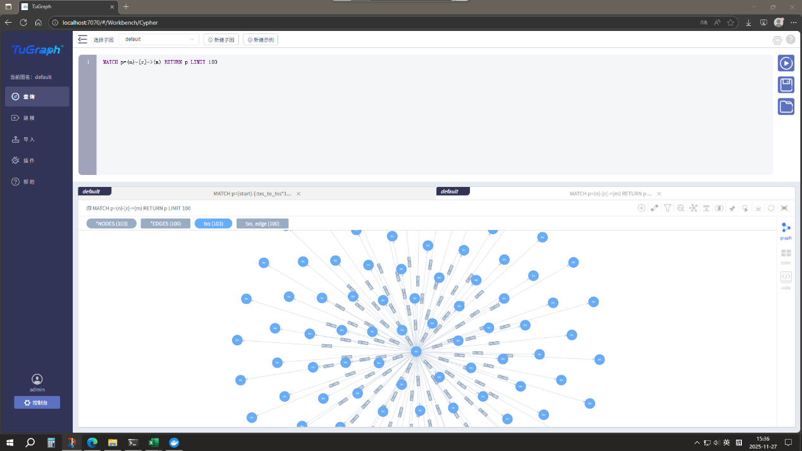

